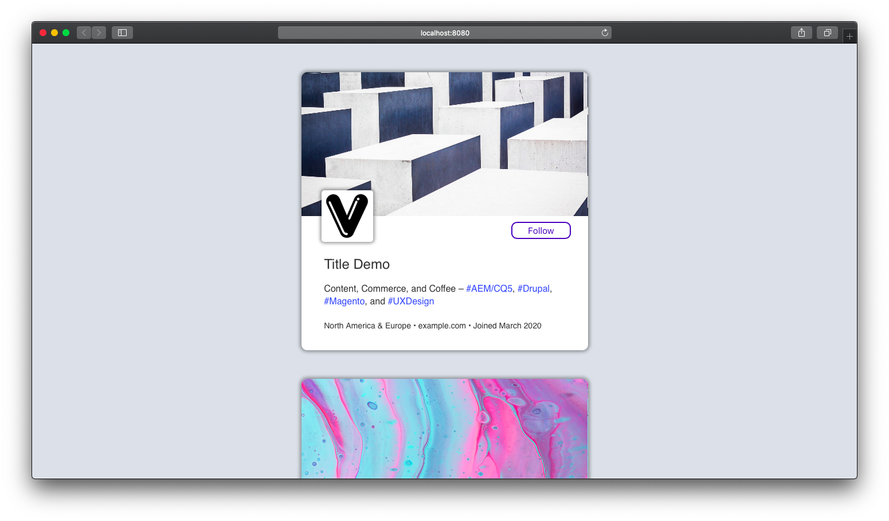

# Profile Component

## Overview

I built a Profile component using vanilla JS(compiled with Babel 7), HTML5, and CSS. It lets you click on the Follow button, that show Following once you click on it, just like Instagram profiles works.

### Demo




## Install

```bash
$  yarn install
```

## Development

```bash
$ yarn dev
```

## Build

```bash
$ yarn build
```
